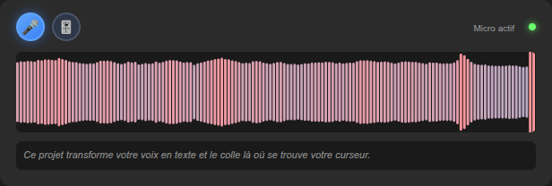
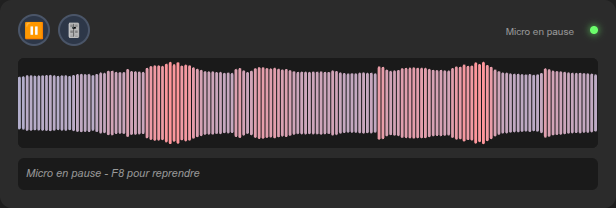
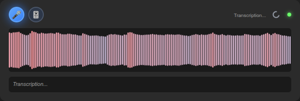
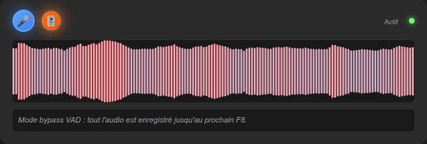

# Dictée vocale locale — micro_transcription

**Vous parlez, le texte s'écrit là où se trouve votre curseur.** Dans n'importe
quelle application, sans passer par le cloud : la reconnaissance vocale tourne
entièrement sur votre machine.



---

## Le problème

Dicter du texte suppose en général d'envoyer sa voix chez un tiers, d'ouvrir une
fenêtre dédiée, puis de copier-coller le résultat. Trois frictions : la
confidentialité, le changement de contexte, le copier-coller.

Ce projet supprime les trois. Un raccourci clavier active le micro ; dès que vous
faites une pause, la phrase est transcrite et **collée directement dans la
fenêtre active** — éditeur de code, navigateur, messagerie. Aucun audio ne quitte
la machine.

Le cœur du problème n'est pas la transcription elle-même (Whisper s'en charge),
mais **savoir quand vous avez fini de parler**. Couper trop tôt tronque la
phrase ; couper trop tard fait attendre. C'est là que se concentre la logique du
projet.

---

## Fonctionnement

```
Micro ──► Détection de voix ──► Détection de fin de phrase ──► Whisper ──► Presse-papiers
          (Silero VAD + ZCR)     (énergie + pitch)                          └─► collage auto
```

**1. Détection d'activité vocale.** Chaque bloc de 0,5 s passe par Silero VAD
(réseau de neurones, en local), complété par un filtre sur le taux de passage par
zéro qui écarte musique et bruits non vocaux. Un mode adaptatif apprend le bruit
ambiant sur les premières secondes et ajuste ses seuils en continu — la voix doit
ressortir d'un facteur donné au-dessus du fond sonore.

**2. Détection de fin de phrase.** Plutôt que d'attendre un délai fixe, le module
combine trois indices : durée du silence, chute d'énergie, et contour de pitch
descendant (une phrase déclarative finit sur une intonation qui tombe). Les
seuils sont **étagés** : plus les indices acoustiques s'accumulent, moins on
exige de silence.

| Indices disponibles | Silence requis |
| --- | --- |
| Silence seul | 5 blocs (2,5 s) |
| Silence + chute d'énergie | 3 blocs (1,5 s) |
| Silence + énergie + pitch | 2 blocs (1,0 s) |

**3. Transcription.** faster-whisper (CTranslate2) sur GPU si disponible, repli
automatique sur CPU. Un filtre anti-hallucinations écarte les artefacts typiques
que Whisper produit sur du silence (« Sous-titrage ST' », « Merci d'avoir
regardé »).

**4. Collage.** Le texte est injecté dans la fenêtre active (xdotool sous X11), et
le contenu antérieur du presse-papiers est restauré.

---

## Stack technique

| Domaine | Choix | Pourquoi |
| --- | --- | --- |
| Transcription | [faster-whisper](https://github.com/SYSTRAN/faster-whisper) (CTranslate2) | 4x plus rapide que l'implémentation de référence, à qualité égale |
| Détection de voix | [Silero VAD](https://github.com/snakers4/silero-vad) | modèle JIT de 2,2 Mo, chargé en local, sans appel réseau |
| Interface | PySide6 / Qt WebEngine | visualiseur en sous-processus isolé, l'UI ne peut pas figer la boucle audio |
| Communication | Flask + Server-Sent Events | flux unidirectionnel cœur → UI, plus simple qu'un WebSocket ici |
| Configuration | pydantic-settings | valeurs typées et validées aux bornes dès le démarrage |
| Capture audio | sounddevice (PortAudio) | callback temps réel, faible latence |
| Raccourcis | pynput | capture globale, hors focus |

---

## Architecture

```
main.py                    Point d'entrée → core.engine.run()
│
├── core/                  Traitement audio et transcription
│   ├── engine.py          Amorçage, orchestration de la boucle principale
│   ├── processor.py       Pipeline audio (aperçu + production)
│   ├── models.py          Chargement Whisper, inférence, filtre anti-hallucinations
│   ├── voice_detector.py  Silero VAD + ZCR + détection adaptative
│   ├── phrase_detector.py Fin de phrase (énergie + pitch)
│   ├── pipeline.py        AudioBuffer, PreviewManager, ProductionManager
│   └── audio_capture.py   Entrée micro, collage presse-papiers
│
├── api/                   Communication inter-modules
│   └── server.py          Flask + diffusion SSE
│
├── ui/                    Visualiseur Qt6 (sous-processus)
│   ├── manager.py         Cycle de vie du sous-processus
│   └── visualizer_app.py  Application PySide6 WebEngine
│
└── shared/                Utilitaires transverses
    ├── context.py         AppContext (état global, sous-contextes verrouillés)
    ├── settings.py        Configuration Pydantic (source de vérité)
    └── persistence.py     Réglages persistants (parametre.json)
```

Deux partis pris structurants :

- **Le visualiseur tourne dans un sous-processus séparé.** Qt WebEngine est
  lourd et peut se bloquer ; l'isoler garantit que la boucle de capture audio,
  elle, ne rate jamais un bloc.
- **L'état partagé est regroupé dans `AppContext`**, découpé en sous-contextes
  (`models`, `sleep`, `audio`, `ui`) qui portent chacun leur verrou. Aucun champ
  mutable n'est lu ou écrit hors de son verrou.

---

## Installation

Testé sur Ubuntu 24.04, Python 3.12.

**1. Dépendances système**

```bash
sudo apt install -y xdotool xclip xsel portaudio19-dev \
                    libxcb-xinerama0 libxcb-cursor0 python3-venv
```

`xdotool` sert au collage sous X11, `portaudio19-dev` à la capture micro.

**2. Environnement Python**

```bash
git clone https://github.com/Skeeder1/micro_transcription.git
cd micro_transcription

python3 -m venv .venv
source .venv/bin/activate
pip install -r requirements.txt
```

Le modèle Whisper est téléchargé au premier lancement (~460 Mo pour `small`,
~3 Go pour `large`). Silero VAD (2,2 Mo) est récupéré une seule fois puis mis en
cache dans `.cache/`.

**GPU** — Le paquet `torch` de PyPI embarque déjà CUDA sur Linux x86_64. Sans
carte NVIDIA, l'application bascule seule sur CPU (utilisez alors un modèle
`small` ou `base`).

---

## Configuration

Tous les réglages ont une valeur par défaut fonctionnelle : **le fichier `.env`
est optionnel**.

```bash
cp .env.example .env
```

Le nommage suit `TRANSCRIBE_<GROUPE>__<CHAMP>` (double underscore) :

```bash
TRANSCRIBE_MODEL__WHISPER_MODEL=small   # tiny|base|small|medium|large
TRANSCRIBE_MODEL__LANGUAGE=fr
TRANSCRIBE_MODEL__DEVICE=cuda           # cuda|cpu|auto
TRANSCRIBE_VAD__SILERO_THRESHOLD=0.1    # plus bas = plus sensible
TRANSCRIBE_SLEEP__AUTO_SLEEP_SECONDS=30
```

Les valeurs sont validées aux bornes au démarrage : une saisie invalide échoue
immédiatement avec un message explicite, plutôt que de dégrader silencieusement
le comportement.

```
pydantic_core._pydantic_core.ValidationError: 1 validation error for Settings
audio.sample_rate
  Input should be greater than or equal to 8000 [input_value='999']
```

**Aucune clé API n'est requise** : Whisper et Silero tournent en local.

---

## Lancement

```bash
source .venv/bin/activate
python main.py
```

Sortie réelle au démarrage :

```
[INFO] 🎤 SYSTÈME DE DICTÉE VOCALE AVANCÉ v2.0
[INFO] 🎯 Initialisation détecteur vocal avancé (mode adaptatif)...
[INFO] [VAD] Silero VAD chargé (local) (threshold=0.1)
[INFO]    → Calibration automatique du bruit ambiant (2 premières secondes)
[INFO] 🌐 Démarrage serveur API SSE...
[INFO] ✅ Serveur API prêt!
[INFO] 🚀 Lancement interface graphique...
[INFO] [Visualizer] Lancé (PID: 56698)
[INFO] ⌨️  Hotkeys: F8 = Enregistrement ON/OFF | F9 = Veille ON/OFF
[INFO] 🎮 Device: CUDA (GPU NVIDIA détecté)
[INFO]    Modèle 'small' chargé avec succès
[INFO] 🔊 Système prêt - Parlez maintenant!
[INFO] ✅ Capture audio démarrée
```

> Le texte transcrit est collé dans la **fenêtre active**. Placez votre curseur
> là où vous voulez écrire avant de parler.

### Raccourcis

| Touche | Effet |
| --- | --- |
| **F9** | Système actif / en veille (ferme le visualiseur, libère le micro) |
| **F8** | Micro actif / en pause (transcrit immédiatement ce qui est en tampon) |

Deux niveaux de veille : après 30 s sans parole le système se met en veille ;
après 30 min il décharge les modèles de la mémoire. F9 relance.

---

## Essayer sans microphone

Pour vérifier une installation ou mesurer les performances sans dépendre d'un
micro, un script pousse un fichier audio dans le pipeline réel. Avec
`--generate`, la phrase est synthétisée par ffmpeg — aucun fichier requis :

```bash
python scripts/demo_pipeline.py --generate
```

```
======================================================================
DEMONSTRATION DU PIPELINE DE TRANSCRIPTION (sans micro)
======================================================================
Fichier   : demo.wav
Duree     : 4.63 s (74080 echantillons a 16000 Hz)
Modele    : small  |  langue: en
Device    : cuda / float16

[1] DETECTION D'ACTIVITE VOCALE  (Silero VAD + taux de passage par zero)
    bloc  1 @  0.00s : VOIX     silero=0.997  rms=0.1111
    bloc  2 @  0.50s : VOIX     silero=1.000  rms=0.1683
    bloc  3 @  1.00s : VOIX     silero=1.000  rms=0.2065
    bloc  4 @  1.50s : VOIX     silero=1.000  rms=0.2109
    bloc  5 @  2.00s : VOIX     silero=1.000  rms=0.0987
    bloc  6 @  2.50s : VOIX     silero=1.000  rms=0.1762
    bloc  7 @  3.00s : VOIX     silero=1.000  rms=0.1376
    bloc  8 @  3.50s : VOIX     silero=1.000  rms=0.1739
    bloc  9 @  4.00s : silence  silero=1.000  rms=0.1312
    -> 8/9 blocs classes comme parole

[2] PREPROCESSING  (passe-haut 80 Hz -> amplification -> normalisation)
    RMS avant : 0.1593
    RMS apres : 0.2153
    Duree     : 1.1 ms

[3] TRANSCRIPTION WHISPER
    Chargement du modele : 0.90 s
    Transcription        : 0.39 s  (x11.9 par rapport au temps reel)

======================================================================
TEXTE TRANSCRIT : 'This project turns your voice into text and pastes it wherever your cursor is.'
======================================================================
```

Mesures relevées sur RTX 4060 Laptop, modèle `small`, précision float16.

---

## Interface

Le visualiseur est une fenêtre compacte, maintenue au premier plan et conçue pour
ne jamais voler le focus — vous continuez à taper pendant qu'elle est ouverte.
Elle donne un retour immédiat sur ce que le système entend et comprend.

**Dictée en cours** — le micro est actif (bouton bleu), la forme d'onde se colore
selon la décision du VAD, et le texte transcrit s'affiche sous l'onde.


**Micro en pause (F8)** — le bouton passe à l'orange. Ce qui restait en tampon a
été transcrit avant la mise en pause.



**Transcription en cours** — un indicateur signale le passage de Whisper, pour
distinguer un traitement en cours d'un système inactif.



**Mode bypass VAD** — second bouton de la barre. La détection de voix est
court-circuitée et tout l'audio est enregistré jusqu'au prochain F8 : utile dans
un environnement bruyant où le VAD découpe mal. Le réglage est persisté dans
`parametre.json`.



<sub>Captures de l'interface réelle (HTML/CSS/JS du projet) branchée sur le
serveur SSE de l'application. La forme d'onde est alimentée par un fichier audio
de test plutôt que par un micro, afin d'obtenir des captures reproductibles.</sub>

---

## Tests

```bash
pip install -r requirements-dev.txt
pytest
```

```
........................................................................ [ 22%]
........................................................................ [ 44%]
........................................................................ [ 67%]
........................................................................ [ 89%]
.................................                                        [100%]
321 passed in 12.93s
```

La suite couvre le VAD, la détection de fin de phrase, le préprocessing, la
machine à états F8/F9, le bus d'événements, la gestion d'erreurs et la
configuration.

`tests/test_end_to_end.py` exerce le pipeline complet sans micro : la parole est
synthétisée par ffmpeg puis poussée dans les vrais composants. Ces tests se
désactivent seuls si ffmpeg est absent. L'inférence Whisper est marquée `slow` :

```bash
pytest -m "not slow"    # boucle de retour rapide
```

---

## Choix techniques notables

**Seuils de fin de phrase étagés.** Un seuil unique force un compromis entre
couper trop tôt et faire attendre. En pondérant le silence requis par les indices
prosodiques disponibles, une phrase clairement terminée est transcrite en 1 s
tandis qu'une hésitation bénéficie de 2,5 s. Ces trois seuils doivent rester
strictement ordonnés — s'ils s'égalisent, la première condition absorbe les
autres et l'analyse prosodique devient du code mort. Un test le vérifie.

**Filtre passe-haut vectorisé.** Le filtre IIR du préprocessing s'écrit
`b = [α, -α]`, `a = [1, -α]` et se délègue à `scipy.signal.lfilter`, dont la
boucle est en C : 445 ms → 10 ms sur un tampon de 30 s, à sortie numériquement
identique (écart max 1,2e-7, soit l'epsilon du float32). Un test de
non-régression compare la sortie à la récurrence Python d'origine.

**Filtre anti-hallucinations en deux familles.** Whisper produit des artefacts
caractéristiques sur du silence. Les chercher tous en sous-chaîne censurait des
phrases légitimes — « j'aime la musique » disparaissait car « musique » figurait
dans la liste. Les motifs courts ne filtrent donc que s'ils constituent le texte
entier ; seules les formules longues et sans ambiguïté (« merci d'avoir
regardé ») sont cherchées en sous-chaîne.

**Configuration validée au démarrage.** Faire échouer le lancement sur une valeur
hors bornes coûte moins cher que diagnostiquer un VAD qui ne déclenche jamais à
cause d'un seuil aberrant.

---

## Limites connues

- **X11 uniquement pour le collage.** Le collage repose sur `xdotool`. Sous
  Wayland, la transcription fonctionne mais l'injection dans la fenêtre active
  est peu fiable.
- **Le premier lancement télécharge le modèle** (~460 Mo à ~3 Go) : prévoir le
  délai.
- **Le module `services/`** (intégration AutoGen pour reformuler le texte
  transcrit) est un squelette non activé.
- **Le mode aperçu temps réel** est désactivé par défaut : il fait tourner une
  seconde passe Whisper en continu, coûteuse pour un gain limité.

---

## Licence

Projet personnel, non publié sous licence explicite à ce jour.
